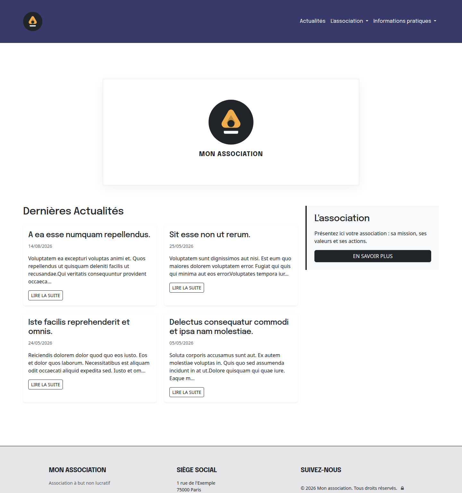
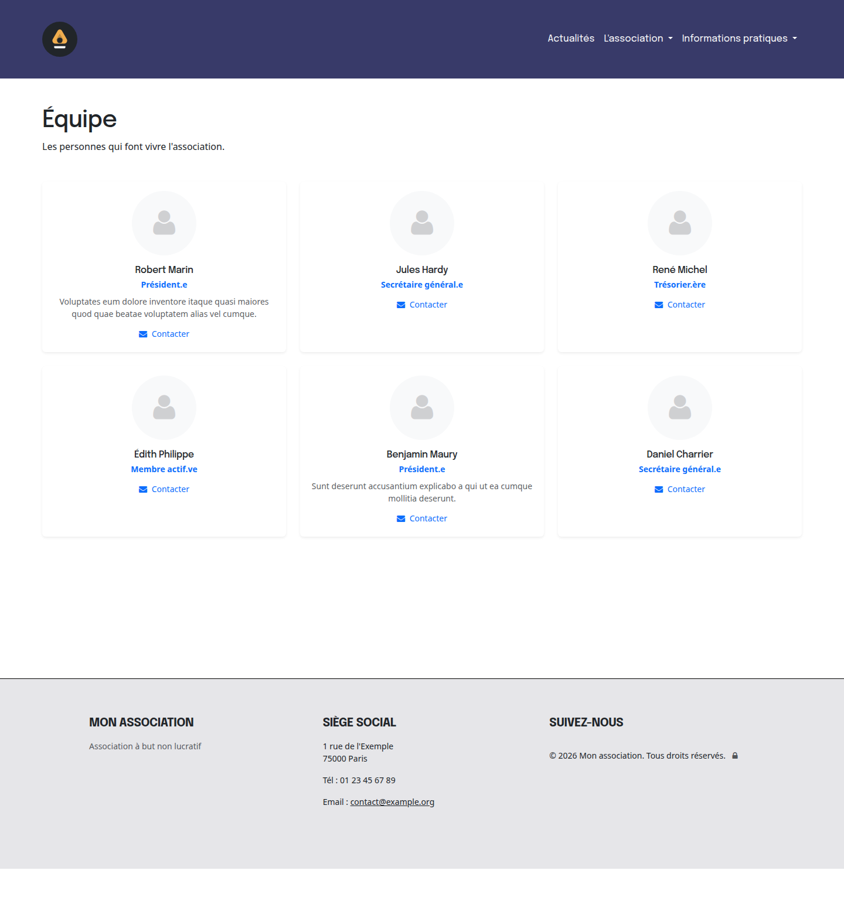
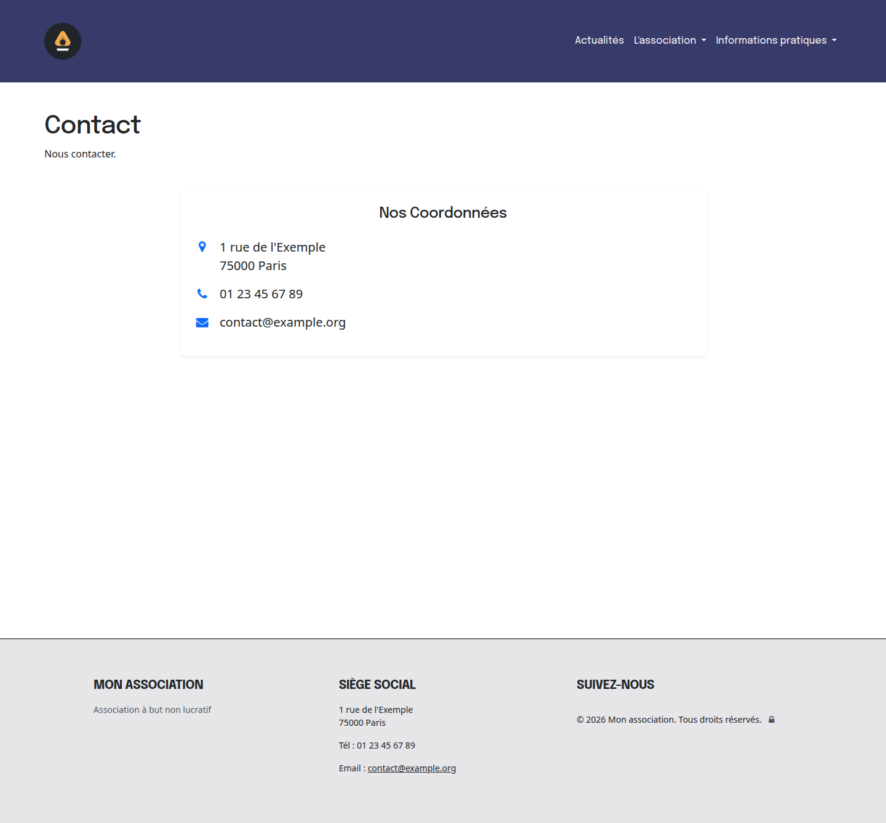
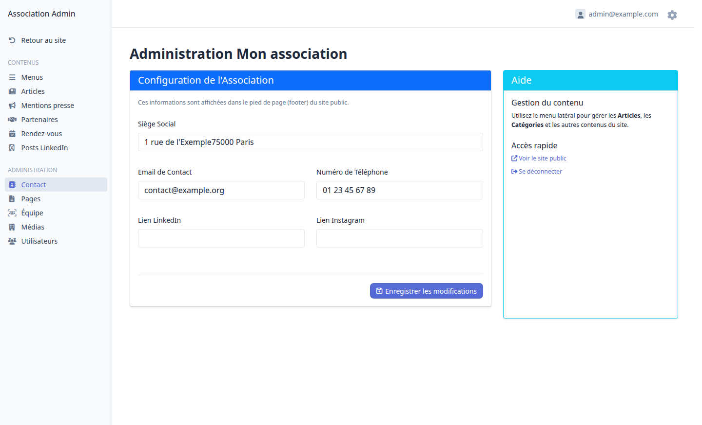

# Association CMS

A reusable, open-source content management starter kit for non-profit
organizations (associations). News, pluggable pages, agenda, team directory,
partners, press review and a complete administration panel — ready to brand
and deploy for any association.

[](https://github.com/lsoulier42/association-cms/actions/workflows/ci.yml)
[](https://www.php.net)
[](https://symfony.com)
[](https://easycorp.github.io/easyadmin/)
[](https://www.postgresql.org)
[](https://www.docker.com)
[](https://phpstan.org)
[](https://github.com/PHPCSStandards/PHP_CodeSniffer)
[](/LICENSE)

## Features

- **News & categories** — articles with automatic navigation menu and
  pagination.
- **Pluggable page types** — pages edited in the admin whose rendering and
  business logic are provided by PHP **page types** (simple content, contact,
  team, partners, agenda, press). Add your own type = one class + one template.
- **Team directory** — members with role, bio, photo, email and display order.
- **Agenda** — appointments list with Excel import.
- **Press review** — press mentions with automatic media logo retrieval.
- **Association settings** — address, contact info, social links.
- **Admin panel** — EasyAdmin 5 with users and roles.
- **Optional LinkedIn module** — automatic import of an organization's posts
  (disabled when not configured).
- **Content import** — CSV/JSON CLI commands to migrate articles, categories,
  press mentions, users…

## Screenshots

The demo data (`make connect` → `doctrine:fixtures:load`) provides the pages
below with a realistic placeholder site.

| Homepage | Team page |
| --- | --- |
|  |  |

| Contact page | Admin panel |
| --- | --- |
|  |  |

## Design

The default theme ships as a clean, centered Bootstrap 5 layout:

- **Typography** — [Epilogue](https://fonts.google.com/specimen/Epilogue)
  for headings, [Open Sans](https://fonts.google.com/specimen/Open+Sans)
  for body text (Google Fonts, loaded in `templates/base.html.twig`).
- **Palette** — design tokens as CSS variables in
  `assets/styles/app.css`: navy accent `#383a69`, light backgrounds
  `#f5f5f5` / `#e6e6e9`, dark text, amber highlight `#f0ad4e` (logo).
- **Components** — dark navbar, card grids (news, team, partners, press),
  bordered sections, rounded buttons; Font Awesome 4 icons.
- **Customize** — edit the `:root` variables in `assets/styles/app.css`,
  the navbar in `templates/layout/_header.html.twig` and replace
  `public/images/logo.svg` / `public/images/favicon.svg` to rebrand the
  whole site.

## Tech stack

| Component  | Version        |
| ---------- | -------------- |
| PHP        | >= 8.5         |
| Symfony    | 8.1            |
| PostgreSQL | 18             |
| EasyAdmin  | 5              |
| Twig + Bootstrap 5 + Asset Mapper (importmap) | — |
| Docker Compose (php-fpm, nginx, postgres, mailpit) | — |

## Getting started

Prerequisites: Docker, Docker Compose and Make.

```bash
cp .env.example .env   # adjust if needed (ports, site name, database)
make install           # build images + composer + assets + start services
```

Then populate the site with demo content:

```bash
make connect
php bin/console doctrine:migrations:migrate --no-interaction
php bin/console doctrine:fixtures:load
```

| Service       | URL                              |
| ------------- | -------------------------------- |
| Application   | http://localhost:8092            |
| Admin panel   | http://localhost:8092/admin      |
| Mailpit       | http://localhost:1182            |

Create an administrator:

```bash
php bin/console app:user:create-admin --email=admin@example.com --password=secret
```

## Customization

- **Site name** — `SITE_NAME` env var, exposed as `site_name` in Twig.
- **Logo & favicon** — replace `public/images/logo.svg` and
  `public/images/favicon.svg`.
- **Appearance** — `assets/styles/app.css` and `templates/base.html.twig`
  (fonts, Bootstrap colors…).
- **Add a page type** — implement `App\Page\PageTypeInterface` (or extend
  `App\Page\AbstractPageType`), add a template in
  `templates/special_page/type/` — the admin form picks it up automatically.

## Project structure

```
src/
├── Controller/           Web controllers (+ Admin/ EasyAdmin CRUDs)
├── Entity/               Doctrine entities (extend AbstractEntity)
├── Page/                 Pluggable page types (registry + built-in types)
├── Repository/           Repositories (extend AbstractRepository)
├── Service/              Domain services (LinkedIn API, media scraper…)
├── DataFixtures/         Demo data (AppFixtures)
└── Twig/                 Twig extensions & globals
templates/                Twig templates (pages + special_page/type/…)
config/                   Symfony config (service tags, routes, …)
docker/                   Dockerfile & service configs
migrations/               Doctrine migrations (single initial migration)
.github/workflows/        CI (PHPStan, PHPCS, PHPUnit)
```

## Development

| Command              | Description                        |
| -------------------- | ---------------------------------- |
| `make start` / `make stop` | Start / stop containers       |
| `make connect`       | Shell into the PHP container       |
| `make clear`         | Clear the Symfony cache            |
| `make migrations`    | Run the migrations                 |
| `make tests`         | Test database + migrations + PHPUnit |
| `make quality`       | PHPStan (level 6) + PHPCS (PSR-12) |
| `make composer-update` | Update Composer vendors          |

Content import CLI:

```bash
php bin/console app:import:content categories /path/to/categories.csv
php bin/console app:import:content articles /path/to/articles.json
php bin/console app:import:content press_mentions /path/to/press.csv --dry-run
```

## Optional LinkedIn module

The LinkedIn posts module works out of the box (embed links entered in the
admin). To enable automatic API import, set in `.env.local`:

```
LINKEDIN_ACCESS_TOKEN=...
LINKEDIN_ORGANIZATION_ID=...
```

## Contributing

Contributions are welcome! Open an issue or a pull request. Please run
`make quality` and `make tests` before submitting.

## License

[MIT](LICENSE)
